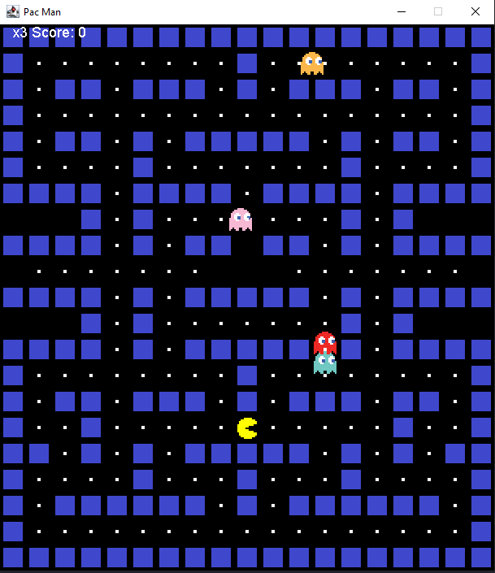

# PacMan em Java
Projeto de um jogo inspirado no clássico Pac-Man, desenvolvido em Java com o objetivo de praticar conceitos de orientação a objetos, interfaces gráficas e lógica de jogos

## Sobre o Projeto

  O jogo possui um mapa baseado em uma matriz de caracteres, onde cada
caractere representa um elemento do cenário, como paredes, Pac-Man,
fantasmas e alimentos.
  O jogador controla o Pac-Man através das teclas direcionais, coleta os
alimentos para aumentar a pontuação e deve evitar os fantasmas.
  O projeto possui um sistema de vidas, pontuação, colisões, movimentação
dos personagens e reinício após o Game Over.

## Funcionalidades

- Movimentação do Pac-Man
- Movimentação dos fantasmas
- Quatro fantasmas:
  -  Azul
  -  Laranja
  -  Rosa
  -  Vermelho
- Sistema de colisão com paredes
- Sistema de colisão com fantasmas
- Sistema de pontuação
- Sistema de vidas
- Coleta de alimentos
- Reinício do mapa após coletar todos os alimentos
- Game Over
- Reinício do jogo após o Game Over
- Alteração da imagem do Pac-Man de acordo com sua direção

O jogo inicia com **3 vidas** e cada alimento coletado adiciona **10 pontos**
à pontuação.

## Controles

| Tecla | Movimento |
|-------|-----------|
| ⬆️ Seta para cima | Move para cima |
| ⬇️ Seta para baixo | Move para baixo |
| ⬅️ Seta para esquerda | Move para esquerda |
| ➡️ Seta para direita | Move para direita |

## Estrutura do Projeto

```text
PacMan/
├── .vscode/
├── bin/
├── lib/
├── src/
│   ├── resources/
│   ├── App.java
│   ├── PacMan.java
│   ├── blueGhost.png
│   ├── cherry.png
│   ├── cherry2.png
│   ├── orangeGhost.png
│   ├── pacmanDown.png
│   ├── pacmanLeft.png
│   ├── pacmanRight.png
│   ├── pacmanUp.png
│   ├── pinkGhost.png
│   ├── powerFood.png
│   ├── redGhost.png
│   ├── scaredGhost.png
│   └── wall.png
│
└── README.md
```
## Demonstração


Autor

Marco Oliveira
Estudante de Ciência da Computação.

Projeto desenvolvido para fins acadêmicos e aprendizado em Java.


